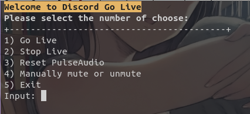

# Discord Go Live
A simple script to stream audio on Discord (Linux)

## Available in:
[🇪🇸 Español](README_es.md)

🇺🇸 English

___
As you may know if you use Discord in Linux, there's a bug with the audio in streamings (~~AKA I can't hear your stream~~), and even using third party clients (ex. ligthcord) the issue stills unsolved.

There's a popular solution out there in which you mix your internal audio and your microphone over a new virtual interface, and actually works great. So that's what I did here: made a simple script in which you can easily switch on/off the mixed interface.

## Dependencies
* Pulseaudio (for `pactl` command)

## Usage
Simply run the script and go on the menu options. After enabling it, you can share your pc audio as if it where your mic (so make sure you unmute yourself on Discord). No extra steps nor need of installing extra stuff.

Discord Go Live takes the default sink and source to create the Virtual1 interface, so if you want to use another sink/source, then modify the `golive` function by changing `@DEFAULT_SINK@` or `@DEFAULT_SOURCE@` for the name of your device.
(You may know this already, but to obtain the names of your devices run: `$ pactl list X` where X is `sinks` or `sources`, depending on your need)

Mute/unmute mic options are also included if you needed, but keep in mind that if you turn it on when Virtual1 interface is enabled, your mics audio will return to your audio output (you will hear yourself).

## Additional notes
* This script doesn't create files on your system, but in /tmp to store the numbers of the pactl modules loaded (so the script can automatically unload them whenever you want). However, don't worry if for some reason you lose the file, **the changes made by this script can be reverted by simply reseting PulseAudio (option included in menu), or restarting the machine**.
