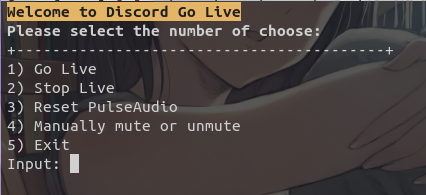

# Discord Go Live
Un script simple para stremear audio en Discord (Linux)

## Disponible en:
🇪🇸 Español

[🇺🇸 English](README)

___
Como ya deberias saber si usas Discord en Linux, hay un bug con el audio cuando haces stream, y esto no se resuelve ni usando otros clientes no oficiales (ej. Lightcord).

Hay una solución muy popular en internet en la que mezclas tu audio interno con tu micrófono en un nuevo canal de audio virtual, y funciona realmente bien. Así que eso es lo que hice: un script que automatiza y simplifica todo este proceso.

## Dependencias
* Pulseaudio (para el comando `pactl`)

## Uso
Solo corre el script en una terminal. Después de iniciar el Go Live, ya puedes compartir tu audio en Discord como si se tratara de tu micrófono (por eso, recuerda desmutearte en Discord para transmitir). No se necesitan pasos extra ni instalar nada.

Discord Go Live toma tu entrada (sink) y salida (source) predeterminada para crear la interfaz Virtual1, así que si quieres usar otra entrada/salida modifica la función `golive` cambiando `@DEFAULT_SINK@` o `@DEFAULT_SOURCE@` por el nombre de tu dispositivo.
(Seguro ya sabes cómo hacerlo, pero si no, para obtener los nombres de tus dispositivos de entrada/salida de audio, corre el comando `$ pactl list X` donde X es `sinks` o `sources`, dependiendo de lo que buscas)

Las opciones de mutear/desmutear están incluídas por si lo necesitas. No obstante, ten en mente que el script lo mutea al activar la interfaz Virtual1 para que el audio de tu micrófono no retorne por tus auriculares.

## Notas adicionales
* Este script no crea nuevos archivos en tu sistema, sino solo en /tmp para almacenar los números de los modulos de pactl cargados (de forma que este script pueda regresar los cambios en el momento que quieras) en un archivo de texto. De cualquier manera, si pierdes este archivo **los cambios realizados por este script pueden ser revertidos con reiniciar PulseAudio (opción incluída en el menu) o reiniciando el sistema.**